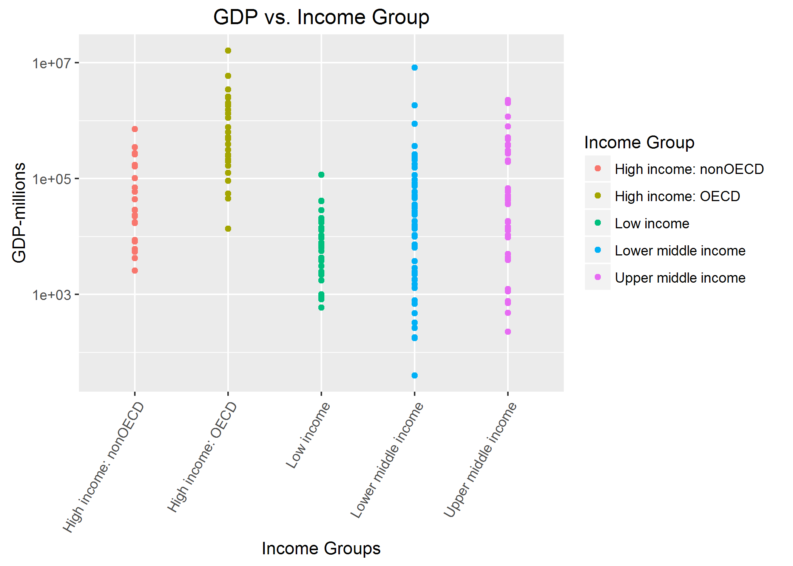
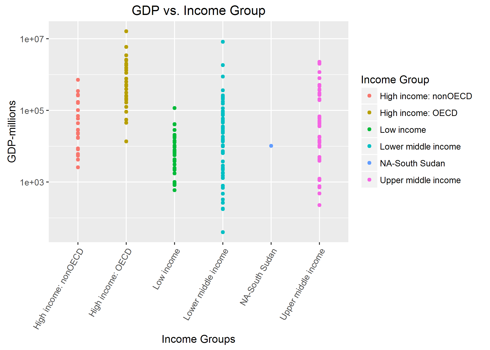

# Case Study I: Rankings of the top 190 GDPs
Damon Resnick  
October 24, 2016  

### Introduction
Gross Domestic product and Education data was downloaded from the [World Bank website](http://www.worldbank.org/). The data was cleaned, tidied, and merged together to form a dataset that could be analyzed to answer these five questions:  

1)  Merge the data based on the country shortcode. How many of the IDs match?     
2)  Sort the data frame in ascending order by GDP (so United States is last). What is the 13th country in the resulting data frame?  
3)  What are the average GDP rankings for the "High income: OECD" and "High income:nonOECD" groups?  
4)  Plot the GDP for all of the countries. Use ggplot2 to color your plot by Income Group.  
5)  Cut the GDP ranking into 5 separate quantile groups. Make a table versus Income Group. How many countries are Lower middle income but among the 38 nations with highest GDP?   

The answers are presented within the file below as it becomes convenient to answer them, and they are also presented and discussed in more detail at the end of this file in the summary and conclusion.  

<br>  

#### The code below should be able to run as R Markdown and present the results in a useful way.
##### This code was designed for use in RStudio on a Windows 10 machine. It should work on other platforms with no changes, however this may not be the case.  

<br>  

##### This first code chunk sets the global options for the all code chunks in this document.  The first sets the width of the code chunks so they fit well and the second sets the size of the figures so that fill up the page well.  


```r
library(knitr)
library(formatR)
opts_chunk$set(tidy.opts=list(width.cutoff=80),tidy=TRUE)
opts_chunk$set(out.width='1000px', dpi=300)
```
<br>

#### Load packages I may need. Set working directory.

```r
library(stats)
library(plyr)
library(ggplot2)
library(repmis)

# setwd('C:/Users/hp/Desktop/SMU/Doing Data Science/Homework/Case Studies')

setwd(".")
```
<br>  

#### Upload the data from the web and load data into two raw data sets in R.
##### This method is quick, but the data is only saved in active memory not on the hard drive.
##### This also makes the columns numeric and character by default.

```r
gdpraw <- source_data("https://d396qusza40orc.cloudfront.net/getdata%2Fdata%2FGDP.csv", 
    skip = 5, header = FALSE)
```

```
## Downloading data from: https://d396qusza40orc.cloudfront.net/getdata%2Fdata%2FGDP.csv
```

```
## SHA-1 hash of the downloaded data file is:
## 18dd2f9ca509a8ace7d8de3831a8f842124c533d
```

```r
fedraw <- source_data("https://d396qusza40orc.cloudfront.net/getdata%2Fdata%2FEDSTATS_Country.csv", 
    header = TRUE)
```

```
## Downloading data from: https://d396qusza40orc.cloudfront.net/getdata%2Fdata%2FEDSTATS_Country.csv
```

```
## SHA-1 hash of the downloaded data file is:
## 20be6ae8245b5a565a815c18a615a83c34745e5e
```
<br>

#### Another way to load the data.  Saves files to the hard drive and then loads into R.
##### This loads the data with slightly different variable names so if you use this make sure to rename them correctly.
##### This has been commented out below.

```r
# GDPFileUrl<-'https://d396qusza40orc.cloudfront.net/getdata%2Fdata%2FGDP.csv'
# FEDFileUrl<-'https://d396qusza40orc.cloudfront.net/getdata%2Fdata%2FEDSTATS_Country.csv'

# download.file(GDPFileUrl,destfile='Data/FGDP_Rank_raw.csv')
# download.file(FEDFileUrl,destfile='Data/FEDSTATS_Country_raw.csv')

# gdpraw <- read.csv('./Data/FGDP_Rank_raw.csv',skip=5,header=FALSE) fedraw <-
# read.csv('./Data/FEDSTATS_Country_raw.csv',header=TRUE)
```
<br>  

#### Looking at the data (Commented out for Markdown)

```r
# head(gdpraw) head(fedraw) str(gdpraw) str(fedraw)
```
<br>  

-The gdpraw data has: 326 obs. of 10 variables.  Only V1, V2, V4, and V5 columns have the data we wish to analyze.  
-The fedraw data has: 234 obs. of 31 variables.  Only 'CountryCode', 'Long Name', and 'Income Group' columns have data of use.


#### Making data file objects so I won't have to load the data later if I need to go back and look at the raw data.

```r
gdpa <- gdpraw
feda <- fedraw
```
<br>  

#### Remove columns that are not needed, rename header, and remove rows without country codes.

```r
## remove all the other columns
gdpa <- gdpa[, c(1, 2, 4, 5)]
head(gdpa)
```

```
##    V1 V2             V4           V5
## 1 USA  1  United States  16,244,600 
## 2 CHN  2          China   8,227,103 
## 3 JPN  3          Japan   5,959,718 
## 4 DEU  4        Germany   3,428,131 
## 5 FRA  5         France   2,612,878 
## 6 GBR  6 United Kingdom   2,471,784
```

```r
## rename header
names.gdpa <- names(gdpa)
# names.feda
names(gdpa) <- c("CountryCode", "Rank", "LongName", "GDP")
names(gdpa)
```

```
## [1] "CountryCode" "Rank"        "LongName"    "GDP"
```

```r
## remove rows without country codes, only the first 215 have country codes
gdpa <- gdpa[1:215, ]
# str(gdpa)

## remove all the other columns
feda <- feda[, c(1, 2, 3)]
head(feda)
```

```
##   CountryCode                    Long Name         Income Group
## 1         ABW                        Aruba High income: nonOECD
## 2         ADO      Principality of Andorra High income: nonOECD
## 3         AFG Islamic State of Afghanistan           Low income
## 4         AGO  People's Republic of Angola  Lower middle income
## 5         ALB          Republic of Albania  Upper middle income
## 6         ARE         United Arab Emirates High income: nonOECD
```

```r
## rename header
names.feda <- names(feda)
# names.feda
names(feda) <- c("CountryCode", "LongName", "IncomeGroup")
names(feda)
```

```
## [1] "CountryCode" "LongName"    "IncomeGroup"
```

```r
# str(feda)
```
<br>  

-The gdpa data has: 215 obs. of 4 variables.  Name changes to "CountryCode", "Rank", "LongName", and "GDP".  
-The feda data has: 234 obs. of 3 variables.  Name changes to "CountryCode", "LongName", and "IncomeGroup".

<br> 

#### Merge files gdpa and feda using the CountryCode as a common column then count the NAs in each column.

```r
mergedfile <- merge(gdpa, feda, by = "CountryCode", all = TRUE)

## Count the number of NAs in each column
mergefile.na <- colSums(is.na(mergedfile))
# mergefile.na
```

<br>  

### Answer to Question 1.

```r
## Answer to question 1:
length(intersect(gdpa$CountryCode, feda$CountryCode))
```

```
## [1] 210
```

```r
## Just a way of seeing the number that did not intersect
length(mergedfile$CountryCode) - length(intersect(gdpa$CountryCode, feda$CountryCode))
```

```
## [1] 29
```
The intersect function finds the elements that are the same in the two columns.   

<br>  

#### Make blank values NAs and make sure the GDP and Rank columns are numeric to answer question 2.
##### I also want to keep track of the NAs before and after.

```r
count(is.na(mergedfile$GDP))
```

```
##       x freq
## 1 FALSE  215
## 2  TRUE   24
```

```r
mergedfile$GDP <- as.numeric(gsub("[^[:digit:]]", "", mergedfile$GDP))
count(is.na(mergedfile$GDP))
```

```
##       x freq
## 1 FALSE  190
## 2  TRUE   49
```

```r
str(mergedfile$GDP)
```

```
##  num [1:239] NA 2584 NA 20497 114147 ...
```

```r
count(is.na(mergedfile$Rank))
```

```
##       x freq
## 1 FALSE  215
## 2  TRUE   24
```

```r
mergedfile$Rank <- as.numeric(gsub("[^[:digit:]]", "", mergedfile$Rank))
count(is.na(mergedfile$Rank))
```

```
##       x freq
## 1 FALSE  190
## 2  TRUE   49
```

```r
str(mergedfile$Rank)
```

```
##  num [1:239] NA 161 NA 105 60 125 32 26 133 NA ...
```

<br>  

###  Answer to Question 2:
#### Sort the data frame in ascending order by GDP (so United States is last). What is the 13th country in the resulting data frame? 

<br>

#### Making a merged file that is sorted by Rank in ascending order and putting any NAs last.

```r
## Use this just to check
mergedsort <- sort(mergedfile$GDP, decreasing = FALSE, na.last = TRUE)

## Answer to question 2: sorting the merged file by GDP in ascending order
mergedsort2 <- mergedfile[order(mergedfile$GDP, decreasing = FALSE, na.last = TRUE), 
    ]
mergedsort2[c(12, 13, 14), c(2, 3, 4)]
```

```
##     Rank          LongName.x GDP
## 82   178             Grenada 767
## 111  178 St. Kitts and Nevis 767
## 231  177             Vanuatu 787
```

```r
mergedsort2[c(13), c(2, 3, 4)]
```

```
##     Rank          LongName.x GDP
## 111  178 St. Kitts and Nevis 767
```
#### As you can see there are 2 12th to last GDPs so there is no 13!  But alphabetically St. Kitts and Nevis is 13th.  

<br>  

#### Remove all rows but the ones with Ranks, and keep only the first 6 columns.
#### Also make two objects that represent only the "High income: OECD" and "High income: nonOECD"

```r
mergedsort3 <- mergedsort2[1:190, c(1:6)]
highincomeOECD <- mergedsort3[mergedsort3$IncomeGroup == "High income: OECD", ]
highincomenonOECD <- mergedsort3[mergedsort3$IncomeGroup == "High income: nonOECD", 
    ]

## Gets rid of NA rows
highincomeOECD <- highincomeOECD[complete.cases(highincomeOECD$GDP), ]
highincomenonOECD <- highincomenonOECD[complete.cases(highincomenonOECD$GDP), ]
```

<br>  

### Answers to Question 3:
#### The averages of the Ranks for the "High income: OECD" and "High income: nonOECD".

```r
## Question 3 Answers:
mean(highincomeOECD$Rank)
```

```
## [1] 32.96667
```

```r
mean(highincomenonOECD$Rank)
```

```
## [1] 91.91304
```

```r
## Average of GDPs as well. Why not?
mean(highincomeOECD$GDP)
```

```
## [1] 1483917
```

```r
mean(highincomenonOECD$GDP)
```

```
## [1] 104349.8
```

<br>  

#### Cleaning up everything else now. Making an object with only countries with Ranks, and getting rid of all the columns I don't seem to need.

```r
GDPall <- mergedsort2[1:190, c(1:6)]

## Clean up GDPall and get rid of all the factors
GDPall$IncomeGroup <- GDPall$IncomeGroup <- as.character(GDPall$IncomeGroup)
GDPall$LongName.x <- as.character(GDPall$LongName.x)
GDPall$LongName.y <- as.character(GDPall$LongName.y)
GDPall$CountryCode <- as.character(GDPall$CountryCode)
```

<br>  

### Answer to question 4:
#### Make a plot of GDP vs. Income Group colored by Income Group.

```r
plot1a <- ggplot(GDPall) + geom_point(aes(y = GDP, x = IncomeGroup, colour = IncomeGroup)) + 
    scale_y_log10()
plot1a + labs(title = "GDP vs. Income Group", x = "Income Groups", y = "GDP-millions", 
    colour = "Income Group") + theme(axis.text.x = element_text(angle = 60, hjust = 1))
```

```
## Warning: Removed 1 rows containing missing values (geom_point).
```



<br>  

#### One row has an NA in the Income Group column so we will replace it with "NA-South Sudan" and plot again.


```r
count(is.na(GDPall$IncomeGroup))
```

```
##       x freq
## 1 FALSE  189
## 2  TRUE    1
```

```r
GDPall$IncomeGroup[is.na(GDPall$IncomeGroup)] <- "NA-South Sudan"
count(is.na(GDPall$IncomeGroup))
```

```
##       x freq
## 1 FALSE  190
```

```r
plot1a <- ggplot(GDPall) + geom_point(aes(y = GDP, x = IncomeGroup, colour = IncomeGroup)) + 
    scale_y_log10()
plot1a + labs(title = "GDP vs. Income Group", x = "Income Groups", y = "GDP-millions", 
    colour = "Income Group") + theme(axis.text.x = element_text(angle = 60, hjust = 1))
```


<br>  

#### Making objects for the other income groups. Why not?

```r
lowincome <- mergedsort3[mergedsort3$IncomeGroup == "Low income", ]
lowermiddleincome <- mergedsort3[mergedsort3$IncomeGroup == "Lower middle income", 
    ]
uppermiddleincome <- mergedsort3[mergedsort3$IncomeGroup == "Upper middle income", 
    ]

count(is.na(lowincome$GDP))
```

```
##       x freq
## 1 FALSE   37
## 2  TRUE    1
```

```r
count(is.na(uppermiddleincome$GDP))
```

```
##       x freq
## 1 FALSE   45
## 2  TRUE    1
```

```r
## Remove NA rows.
lowincome <- lowincome[complete.cases(lowincome$GDP), ]
lowermiddleincome <- lowermiddleincome[complete.cases(lowermiddleincome$GDP), ]
uppermiddleincome <- uppermiddleincome[complete.cases(uppermiddleincome$GDP), ]
count(is.na(lowincome$GDP))
```

```
##       x freq
## 1 FALSE   37
```

```r
count(is.na(uppermiddleincome$GDP))
```

```
##       x freq
## 1 FALSE   45
```

<br>  

### Answers to Question 5:
#### Cut the GDP ranking into 5 separate quantile groups. Make a table versus Income Group. How many countries are Lower middle income but among the 38 nations with highest GDP?
#### Use quantile function to break up the data into 5 Rank Quantiles

```r
data.quant <- quantile(GDPall$Rank, seq(0, 1, 0.2))
data.quant
```

```
##    0%   20%   40%   60%   80%  100% 
##   1.0  38.8  76.6 114.4 152.2 190.0
```

```r
## This gave us 38.8 as the cuttoff, so below are two ways to get the answer
lowermiddleincome[which(lowermiddleincome$Rank < 38.8), c(1, 2, 3, 4, 6)]
```

```
##     CountryCode Rank       LongName.x     GDP         IncomeGroup
## 62          EGY   38 Egypt, Arab Rep.  262832 Lower middle income
## 211         THA   31         Thailand  365966 Lower middle income
## 94          IDN   16        Indonesia  878043 Lower middle income
## 96          IND   10            India 1841710 Lower middle income
## 38          CHN    2            China 8227103 Lower middle income
```

```r
GDPall[which(GDPall$Rank < 38.8 & GDPall$IncomeGroup == "Lower middle income"), c(1, 
    2, 3, 4, 6)]
```

```
##     CountryCode Rank       LongName.x     GDP         IncomeGroup
## 62          EGY   38 Egypt, Arab Rep.  262832 Lower middle income
## 211         THA   31         Thailand  365966 Lower middle income
## 94          IDN   16        Indonesia  878043 Lower middle income
## 96          IND   10            India 1841710 Lower middle income
## 38          CHN    2            China 8227103 Lower middle income
```

```r
nrow(GDPall[which(GDPall$Rank < 38.8 & GDPall$IncomeGroup == "Lower middle income"), 
    ])
```

```
## [1] 5
```

```r
## Another way to do it is to make a table, first figure out the quantile cutoff
## points
brk <- with(GDPall, quantile(GDPall$GDP, probs = c(0, 0.2, 0.4, 0.6, 0.8, 1)))
data.quant2 <- within(GDPall, quantile <- cut(GDPall$GDP, breaks = brk, labels = 1:5, 
    include.lowest = TRUE))

## Checking
nrow(data.quant2[which(data.quant2$quantile == 5 & data.quant2$IncomeGroup == "Lower middle income"), 
    ])
```

```
## [1] 5
```

```r
## Table answers question 5.
table(data.quant2$IncomeGroup, data.quant2$quantile)
```

```
##                       
##                         1  2  3  4  5
##   High income: nonOECD  2  4  8  5  4
##   High income: OECD     0  1  1 10 18
##   Low income           11 16  9  1  0
##   Lower middle income  16  8 12 13  5
##   NA-South Sudan        0  1  0  0  0
##   Upper middle income   9  8  8  9 11
```

```r
## You can see that there are only 5 total countries in the Lower middle income
## group that are also in the 5th and highest quantile Those countries are again
GDPall[which(GDPall$Rank < 38.8 & GDPall$IncomeGroup == "Lower middle income"), c(1, 
    2, 3, 4, 6)]
```

```
##     CountryCode Rank       LongName.x     GDP         IncomeGroup
## 62          EGY   38 Egypt, Arab Rep.  262832 Lower middle income
## 211         THA   31         Thailand  365966 Lower middle income
## 94          IDN   16        Indonesia  878043 Lower middle income
## 96          IND   10            India 1841710 Lower middle income
## 38          CHN    2            China 8227103 Lower middle income
```

<br>  


### Summary of Answers    

#### Question 1)
#### Merge the data based on the country shortcode. How many of the IDs match?     

```r
## Answer to question 1:
length(intersect(gdpa$CountryCode, feda$CountryCode))
```

```
## [1] 210
```
- Answer: 210 Country codes match using the intersect function.  So as we merge the data only these countries will be considered.  This works well because 190 of these 210 countries also have recorded GDPs and ranking values.

<br>  

#### Question 2)
#### Sort the data frame in ascending order by GDP (so United States is last). What is the 13th country in the resulting data frame?

```r
mergedsort2[c(12, 13, 14), c(2, 3, 4)]
```

```
##     Rank          LongName.x GDP
## 82   178             Grenada 767
## 111  178 St. Kitts and Nevis 767
## 231  177             Vanuatu 787
```

```r
mergedsort2[c(13), c(2, 3, 4)]
```

```
##     Rank          LongName.x GDP
## 111  178 St. Kitts and Nevis 767
```
- Answer: As you can see there are two 12th to last GDPs so there is no 13th!  Alphabetically St. Kitts and Nevis is the 13th.  

<br>  

#### Question 3)
#### What are the average GDP rankings for the "High income: OECD" and "High income:nonOECD" groups?

```r
mean(highincomeOECD$Rank)
```

```
## [1] 32.96667
```

```r
mean(highincomenonOECD$Rank)
```

```
## [1] 91.91304
```
- Answer: The "High income: OECD" has an average Rank of 32.97, and the "High income:nonOECD" has an average Rank of 91.91.  

<br>  

#### Question 4)
#### Plot the GDP for all of the countries. Use ggplot2 to color your plot by Income Group.

```r
plot1a <- ggplot(GDPall) + geom_point(aes(y = GDP, x = IncomeGroup, colour = IncomeGroup)) + 
    scale_y_log10()
plot1a + labs(title = "GDP vs. Income Group", x = "Income Groups", y = "GDP-millions", 
    colour = "Income Group") + theme(axis.text.x = element_text(angle = 60, hjust = 1))
```



<br>  

- Answer: The plot shows all five income groups as well as South Sudan which was not assigned an Income Group.  The figure shows the GDP for each country in millions of US dollars along the vertical axis plotted versus the 5 income groups as well as the one country not given an income group along the horizontal axis.  South Sudan should probably have been assigned to the Lower middle income group as it is closest to the mean of that group.

<br>  

#### Question 5)
#### Cut the GDP ranking into 5 separate quantile groups. Make a table versus Income Group. How many countries are Lower middle income but among the 38 nations with highest GDP?

```r
table(data.quant2$IncomeGroup, data.quant2$quantile)
```

```
##                       
##                         1  2  3  4  5
##   High income: nonOECD  2  4  8  5  4
##   High income: OECD     0  1  1 10 18
##   Low income           11 16  9  1  0
##   Lower middle income  16  8 12 13  5
##   NA-South Sudan        0  1  0  0  0
##   Upper middle income   9  8  8  9 11
```

```r
# Display the countries that are in the 5th quantile and also in 'Lower middle
# income group'.
GDPall[which(GDPall$Rank < 38.8 & GDPall$IncomeGroup == "Lower middle income"), c(1, 
    2, 3, 4, 6)]
```

```
##     CountryCode Rank       LongName.x     GDP         IncomeGroup
## 62          EGY   38 Egypt, Arab Rep.  262832 Lower middle income
## 211         THA   31         Thailand  365966 Lower middle income
## 94          IDN   16        Indonesia  878043 Lower middle income
## 96          IND   10            India 1841710 Lower middle income
## 38          CHN    2            China 8227103 Lower middle income
```

- Answer: The table shows how many of each income group falls into the 5 quantiles. You can see that there are only five total countries in the upper 38, or 5th quantile, of GDP assigned to the Lower middle income group while the "High income: OECD" group has the largest number of countries in the top 38.  I have also listed the coutries that are in the 5th quantile and also in "Lower middle income group".

<br>  

### Summary and Conclusions
Gross Domestic product and Education data was downloaded from the World Bank website. The data was cleaned and merged together to form a dataset that could be analyzed to answer five questions.  The presentation of the code, values, tables, and plots help to demonstrate the usefulness of R and different R packages.  The main point here is to clean and tidy your data as soon as possible to make answering questions about it and with it much easier.  

<br>  

##### I would like to thank the instructor and others for help creating this RMD file.


