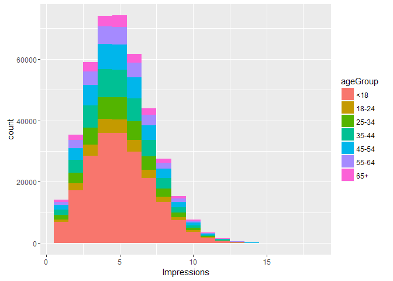
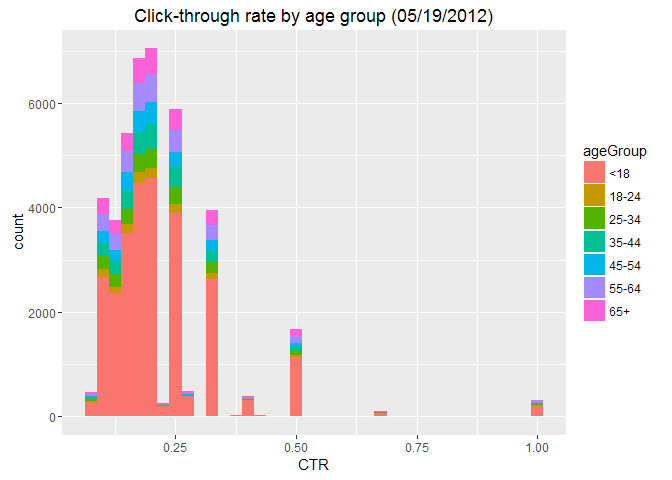
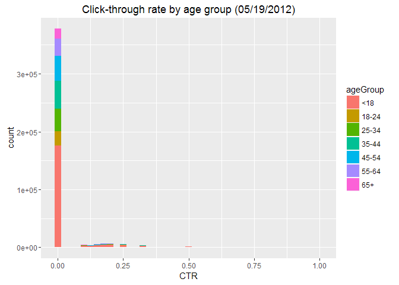

# Live Session Unit 10 Assignment
Damon Resnick  
November 17, 2016  

### Load Data


```r
ny19rawdata <- read.csv("./nyt19.csv", header=TRUE)
#summary(ny19rawdata)
#str(ny19rawdata)

## https://rpubs.com/tmcfl/simulated-click-analysis
```


```r
nyt19data <- ny19rawdata
nyt19data$ageGroup <- cut(nyt19data$Age, c(-Inf, 18, 24, 34, 44, 54, 64, Inf))
levels(nyt19data$ageGroup) <- c("<18","18-24","25-34","35-44","45-54","55-64","65+")

## Create object ImpSub for rest of analysis as well as CTR variable of click through rate
ImpSub<- subset(nyt19data, Impressions>0)
ImpSub$CTR <- ImpSub$Clicks/ImpSub$Impressions
#head(ImpSub)


## Make ImpSub$CTR factor with right breaks and levels
ImpSub$CTR <- cut(ImpSub$Clicks/ImpSub$Impressions,c(-Inf, .2, .4, .6, .8, Inf) )
levels(ImpSub$CTR) <- c("<.2",".2-.4",".4-.6",".6-.8",">.8")


## Find total number of males, male impressions, male clicks, and male signed_in
ImpSubMale <- subset(ImpSub, Gender==1)
#summary(ImpSubMale)
#str(ImpSubMale)
## Number of Males:
nrow(ImpSubMale)
```

```
## [1] 120643
```

```r
## Number of Male Impressions:
sum(ImpSubMale$Impressions)
```

```
## [1] 607864
```

```r
## Number of Male Clicks:
sum(ImpSubMale$Clicks)
```

```
## [1] 8440
```

```r
## Number of Male Signed_In:
sum(ImpSubMale$Signed_In)
```

```
## [1] 120643
```

```r
length(which(ImpSubMale$Signed_In == 1))
```

```
## [1] 120643
```

```r
## Find mean of Age, Impressions, Clicks, and CTR, and percentage of males and signed_In
mean(ImpSub$Age)
```

```
## [1] 23.09464
```

```r
mean(ImpSub$Impressions)
```

```
## [1] 5.039012
```

```r
mean(ImpSub$Clicks)
```

```
## [1] 0.1048234
```

```r
mean(ImpSub$CTR)
```

```
## Warning in mean.default(ImpSub$CTR): argument is not numeric or logical:
## returning NA
```

```
## [1] NA
```

```r
paste(length(which(ImpSub$Gender == 1))/length(ImpSub$Gender)*100,"%",sep="")
```

```
## [1] "28.7845601778948%"
```

```r
paste(length(which(ImpSub$Signed_In == 1))/length(ImpSub$Signed_In)*100,"%",sep="")
```

```
## [1] "54.8997432740669%"
```

```r
## Number of Males and Females the factor way:
#summary(ImpSub)
ImpSub$GenderFactor <- cut(ImpSub$Gender, c(-Inf,0,Inf))
levels(ImpSub$GenderFactor) <- c("Female","Male")
summary(ImpSub$GenderFactor)
```

```
## Female   Male 
## 298481 120643
```


```r
## Get the means of Impressions, Clicks, CTR and percentage of males and signed_In by AgeGroup.
#aggregate(ImpSub$Impressions ~ ImpSub$ageGroup, FUN = mean)
tapply(ImpSub$Impressions, ImpSub$ageGroup, FUN = mean)
```

```
##      <18    18-24    25-34    35-44    45-54    55-64      65+ 
## 5.039314 5.031772 5.052690 5.036124 5.042863 5.034984 5.022416
```

```r
#aggregate(ImpSub$Clicks ~ ImpSub$ageGroup, FUN = mean)
tapply(ImpSub$Clicks, ImpSub$ageGroup, FUN = mean)
```

```
##        <18      18-24      25-34      35-44      45-54      55-64 
## 0.14398743 0.04947178 0.05266604 0.05069923 0.05010107 0.10177570 
##        65+ 
## 0.15173082
```

```r
#aggregate(as.numeric(ImpSub$CTR) ~ ImpSub$ageGroup, FUN = mean)
tapply(as.numeric(ImpSub$CTR), ImpSub$ageGroup, FUN = mean)
```

```
##      <18    18-24    25-34    35-44    45-54    55-64      65+ 
## 1.053684 1.017384 1.018356 1.016742 1.015889 1.037632 1.056403
```

```r
# Percentage of males by AgeGroup
tapply(ImpSub$Gender, ImpSub$ageGroup, FUN = sum)/length(ImpSub$Gender)*100
```

```
##      <18    18-24    25-34    35-44    45-54    55-64      65+ 
## 2.145427 3.259894 5.215402 6.468730 5.848627 4.062521 1.783959
```

```r
# Percentage of signed_In by AgeGroup
tapply(ImpSub$Signed_In, ImpSub$ageGroup, FUN = sum)/length(ImpSub$Signed_In)*100
```

```
##       <18     18-24     25-34     35-44     45-54     55-64       65+ 
##  3.330041  6.052624  9.839809 12.113360 10.976942  7.658831  4.928136
```


```r
## Create a table of CTRGroup vs AgeGroup counts.
#str(ImpSub)
table(ImpSub$CTR,ImpSub$ageGroup)
```

```
##        
##            <18  18-24  25-34  35-44  45-54  55-64    65+
##   <.2   194040  25014  40617  50039  45394  31145  19703
##   .2-.4   7483    294    533    639    519    773    787
##   .4-.6   1172     46     69     78     81    144    135
##   .6-.8     82      1      2      1      2      5     12
##   >.8      206     13     20     13     11     33     18
```


```r
## Plot distributions of number impressions and clickthrough - rate (CTR = click/impression) for the age groups

nyt19data <- ny19rawdata
nyt19data$ageGroup <- cut(nyt19data$Age, c(-Inf, 18, 24, 34, 44, 54, 64, Inf))
levels(nyt19data$ageGroup) <- c("<18","18-24","25-34","35-44","45-54","55-64","65+")

## Create object ImpSub for rest of analysis as well as CTR variable of click through rate
ImpSub<- subset(nyt19data, Impressions>0)
ImpSub$CTR <- ImpSub$Clicks/ImpSub$Impressions
#head(ImpSub)

library(ggplot2)

## Histogram of Impressions by ageGroup 
ggplot(ImpSub, aes(x=Impressions, fill=ageGroup))+geom_histogram(binwidth = 1)
```

<!-- -->

```r
## Histogram of Click through rate (CTR) above 0 by ageGroup
ggplot(subset(ImpSub, CTR>0), aes(x=CTR, fill=ageGroup))+ labs(title="Click-through rate by age group (05/19/2012)")+ geom_histogram(binwidth = .025)
```

<!-- -->

```r
## One more plot you think which is important to look at.

## Histogram of all Click through rates (CTR) by ageGroup
ggplot(ImpSub, aes(x=CTR, fill=ageGroup))+ labs(title="Click-through rate by age group (05/19/2012)")+ geom_histogram(binwidth = .025)
```

<!-- -->


